# Annotation guidelines

The annotation guidelines are a collection of best practices and indications on how the
data should be annotated to support documents containing references in footnotes. They
complement what's described in the related models in the
[Grobid documentation](https://grobid.readthedocs.io/en/latest/training/General-principles/).

> [!NOTE]
> The guidelines assume that:
> - The annotators are familiar with the type of documents to be annotated
> - The annotators are familiar with the annotation tool

## General strategy

The way annotations are expressed is not always unique, and different interpretations
from different people (with perhaps different experience and background) are expected.
For this reason these guidelines are a "living" document and may change over time.

There are different strategies for annotation:
- blind annotations + review: annotators work on the same documents and one reviewer
  consolidates the different output
- double round: each annotator works on a portion of the dataset, and revises other
  people's annotations

The work will be organised in iterations where the team performs the following tasks:
- annotation
- correction
- training/evaluation
- feedback
- update guidelines

The input files are PDF documents that are pre-annotated by the ML models. The
annotators then have to correct the pre-annotated output from the model.

> [!WARNING]
> Questions, discussions and decisions should be passed imperatively via GitHub issues
> at <https://github.com/mpilhlt/fossil/issues>.

> [!NOTE]
> The technical description on how to generate training data is provided in the Grobid
> documentation
> [here](https://grobid.readthedocs.io/en/latest/training/General-principles/#generating-pre-annotated-training-data).

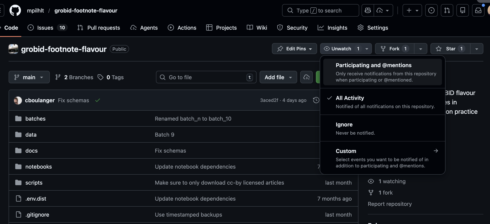

## Data correction

The most important principle when correcting the pre-annotated training data is to keep
the stream of text untouched. Only the tags can be moved, the text itself shall not be
modified or corrected. The stream of text present in the training file after extraction
of the content of the PDF is similar to the stream of text Grobid will have to process
once the models are (re)created. It is thus important to have Grobid trained on this
real-world input, even if it contains OCR errors, noise, unknown unicode characters,
etc. Therefore, **never** correct mistakes in the text — leave everything as it is.

There are three exceptions to this main rule:

1. Actual end-of-lines from the PDF files are indicated by the element `<lb/>`. These
   tags are not annotation tags, but should be considered part of the stream of text.
   They therefore must not be moved or removed with respect to the overall text stream.

2. Line breaks and changes of indentation are accepted outside the main tags to make
   the formatting more readable.

   > [!TIP]
   > Example:
   >
   > ```xml
   > <text>
   >             <body>...</body><listBibl>...</listBibl><page>...</page>
   > </text>
   > ```
   >
   > can safely be reformatted to
   >
   > ```xml
   > <text>
   >     <body>...</body>
   >
   >     <listBibl>...</listBibl>
   >
   >     <page>...</page>
   > </text>
   > ```

3. In the TEI/XML files, an end-of-line is equivalent to a space character — it is thus
   possible to add or remove end-of-line characters as long as the spacing is
   preserved.

   > [!TIP]
   > See this example from the
   > [Grobid documentation](https://grobid.readthedocs.io/en/latest/training/General-principles/):
   >
   > ```xml
   > <title level="a">In XML training files, end-of-line and space are the same</title> <lb/> <author>Kermitt Jr</author> <lb/> <date>2017</date>
   > ```
   >
   > is equivalent to
   >
   > ```xml
   > <title level="a">In XML training files, end-of-line and space are
   >     the same</title> <lb/>
   >     <author>Kermitt Jr</author>
   >     <lb/>
   >
   >     <date>2017</date>
   > ```

## Document segmentation model

> [!NOTE]
> Model name in the PDF-TEI-Editor: `grobid.training.segmentation`, training files end
> in `.training.segmentation.tei.xml`

This section complements what's described in the
[related model in the Grobid documentation](https://grobid.readthedocs.io/en/latest/training/segmentation/).

The general structure of the files is:

```xml
<?xml version="1.0" encoding="UTF-8"?>
<TEI xmlns="http://www.tei-c.org/ns/1.0">
  <teiHeader>
    <!-- document metadata -->
  </teiHeader>
  <text>
    <titlePage>
      Cover page, or pages that are leftover from the journal that are not fully related to the article
    </titlePage>

    <div type="toc">
      Table of content
    </div>

    <front>
      Front matter content. This includes:
        - title
        - abstract
        - footnotes containing affiliations and acknowledgements
      line breaks: <lb/>
    1<lb/>
    </front>

    <!-- more <front> tags as needed -->

    <note place="headnote">Headers, if any, such as journal name or edition, author name, title of the article from Page 2<lb/></note>

    <body>
      Body content: this is the text of the article / chapter without the footnotes, including section headings, illustrations, etc.<lb/>
    </body>

    <listBibl>
      All footnotes that contain reference data<lb/>
    </listBibl>

    <note place="footnote">Any footnotes that do not contain references, or footers containing repeating text, similar to the headnote<lb/></note>

    <!-- more <note>, <body> and <listBibl> tags -->

    <note place="footnote">Endnotes, if any, which do not contain references, otherwise use listBibl<lb/></note>

    <div type="acknowledgment|availability|funding|annex">
      Any type of annex for acknowledgement, availability, funding or other information that is not in the header but attached to the end of the article
    </div>

  </text>
</TEI>
```

We introduce a new label, `<div type="toc">`, to mark the table of contents in the
document when present. For the moment, the block within this tag is ignored until
enough training data is available.

### Tags

The following TEI elements are used by the segmentation model:

* `<titlePage>` for the cover page
* `<front>` for the document header
* `<note place="headnote">` for the page header
* `<note place="footnote">` for the page footer and numbered footnotes
* `<body>` for the document body
* `<listBibl>` for the bibliographical section
* `<page>` to indicate page numbers
* `<div type="toc">` for table of content
* `<div type="conflict">` for conflict of interest statements (when not placed in the header)
* `<div type="contribution">` for author contribution statements (when not placed in the header)
* `<div type="acknowledgement">` for acknowledgment statement in the annex (note that both British and American spelling are accepted by Grobid)
* `<div type="availability">` for data and code availability statement annex (when not placed in the header)
* `<div type="funding">` for funding information annex (when not placed in the header)
* `<div type="annex">` for any other annexes

It is necessary to identify these substructures when interrupting the `<body>`. Figures
and tables (including their potential titles, captions and notes) are considered part
of the body, so they are contained by the `<body>` element.

Note that the markup overall follows the [TEI](http://www.tei-c.org) conventions.

> [!TIP]
> It is highly recommended to study the existing training documents for the
> segmentation model first, to see examples of how these elements should be used.

### Analysis

The following sections provide detailed information and examples on how to handle
certain typical cases.

#### Start of the document (cover page and header)

##### Cover page (`<titlePage>`)

An optional cover page — usually added by the publisher to summarize the
bibliographical and copyright information — might be present, and needs to be entirely
identified by the `<titlePage>` element. The cover page is considered an addition to a
standalone well-formed article. The content of a cover page is usually redundant with
the bibliographical information found in the article header. A cover page usually
corresponds to the content of the entire first page.

##### Header (`<front>`)

The header section typically contains bibliographical information, such as the
document's title, author(s) possibly with affiliations, abstract, keywords, container
journal title, etc. The header usually covers everything until the start of the article
body (e.g. until reaching the introduction of the article). While a cover page is
optional, an article should normally always include a header, even if limited to the
title.

> [!NOTE]
> For the segmentation model, there are no `<title>` or `<author>` elements, because
> they are handled in the `header` model which is applied in cascade at the next stage,
> in the content identified by the segmentation model as "header".

All this material should be contained within the `<front>` element. In addition, any
footnotes that are referenced from within the header (for example when author
affiliations and addresses are expressed in footnotes) should also be annotated under a
`<front>` element. Furthermore, the footer including the first page number should go in
the header, because it indicates the first page of the article, which is a useful and
common piece of bibliographical information.

In general, we expect to find all the bibliographical information of the document as
part of the header. This principle should be followed in every document in order to
ensure homogeneity of the "header" content across the training data.

Lines like the following, indicating bibliographical metadata, appearing as a footnote
on the first page of the document, should be contained inside a `<front>` element:
* Received: [date]
* Revised: [date]
* Accepted: [date]

However, any footnotes referenced from within the `<body>` should remain outside the
header element, even if they are on the first page or surrounded by `<front>`
fragments.

There should be as many `<front>` elements as necessary to contain all the content
identified as "front content" (bibliographical information), not necessarily limited to
the first pages. `<front>` can contain items that are not always at the beginning of
the document, such as:

* Copyright information / Open Access licence and statement
* Correspondence information
* Detailed affiliation and address information
* Submission information: when the document was received, approved and published

These elements relatively frequently appear at the very end of an article or just after
the document body. However, for consistency, they should be annotated under `<front>`
because they are bibliographical information covered by the header model.

The following information blocks sometimes appear inside the article header, so they
should be annotated as `<front>`:

* Author contributions
* Ethics and competing interests
* Funding
* Data / code availability statement

However, when they instead appear as annexes after the document body, they should be
annotated as `<div type="annex">` (see next section), not under `<front>`.

It is possible that the position of a title in the text flow of a document differs from
the visual layout of the document.

The following TEI XML annotation shows the presence of a `<front>` element surrounding
both the topic and the title:

```xml
virus. <lb/>But is the role of LGP2 in CD8 + T cell <lb/>survival and function cell
intrinsic <lb/></body>

<front>A N T I V I R A L I M U N I T Y <lb/>LGP2 rigs CD8 + T cells for
survival <lb/></front>

<body> or extrinsic? T cell receptor-and <lb/>IFNβ-mediated signalling in CD8 + T
```

> [!NOTE]
> In general, whether the `<lb/>` (line break) element is inside or outside `<front>`
> or other elements is of no importance. However, as indicated in
> [Data correction](#data-correction), the `<lb/>` element should not be removed and
> should follow the stream of text.

Sometimes an article starts mid-page, with the end of the preceding one occupying the
upper first third of the page. As this content does not belong to the article in
question, don't add any elements and remove any `<front>` or `<body>` elements that
could appear in the preceding article.

#### Additional information `<div type="...">`

Additional and supporting information sections, which are located **after the body** of
the article (typically after the conclusion), should be annotated under
`<div type="annex">` or the following more specific annex types:

* `<div type="acknowledgment">` for acknowledgment annex (including funding/grant acknowledgement when inside an acknowledgement section)
* `<div type="availability">` for data and code availability statement annex
* `<div type="funding">` for funding information annex

> [!NOTE]
> Different sections of annex type should be segmented into separate
> `<div type="annex">` elements to capture the start and end of each section block.

Supplementary texts, supplementary figures and tables, and any similar appendix should
all be encoded under `<div type="annex">`.

#### Elements interrupting the document body: headnotes and footnotes

Any information appearing in the page header needs to be surrounded by a
`<note place="headnote">`.

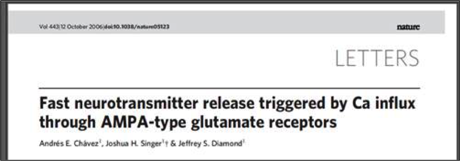

The contents of the grey band in the screenshot above should be surrounded by a
`<note place="headnote">`, except on the first page, where this type of information
would be inside the `<front>` element.

Any information appearing in the page footer needs to be put inside a
`<note place="footnote">`, as shown in the following example:

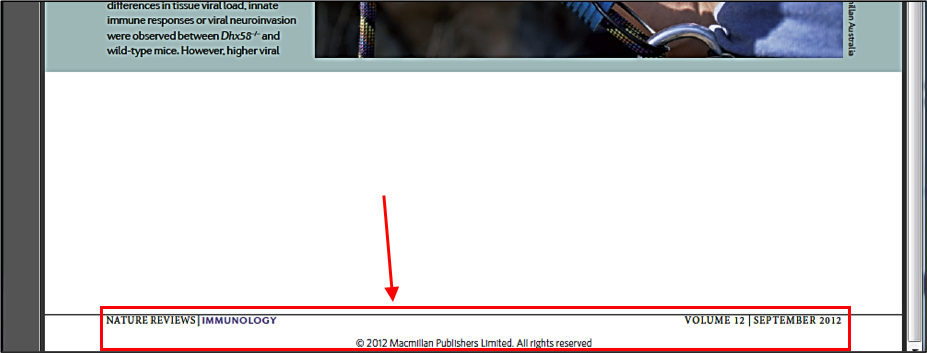

Corresponding TEI XML:

```xml
<note place="footnote">NATURE REVIEWS | IMMUNOLOGY <lb/>VOLUME 12 |
	SEPTEMBER 2012 <lb/>© 2012 Macmillan Publishers Limited. All rights reserved</note>
```

The `<page>` element, which contains the page number, should be outside any of the
above `<note>` elements.

Any notes to the left of the main body text are to be encoded as `<note>` if they are
related to an element of the `<body>`; if they concern header elements, they go into a
`<front>` element. See this screenshot as an example:

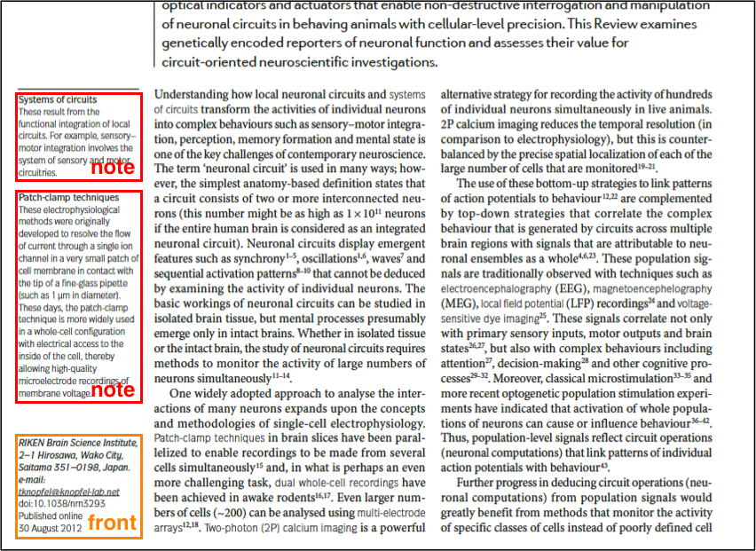

References are expected to also be placed in the footnotes, in three different styles:

1. Header information, such as affiliation or publication information.

   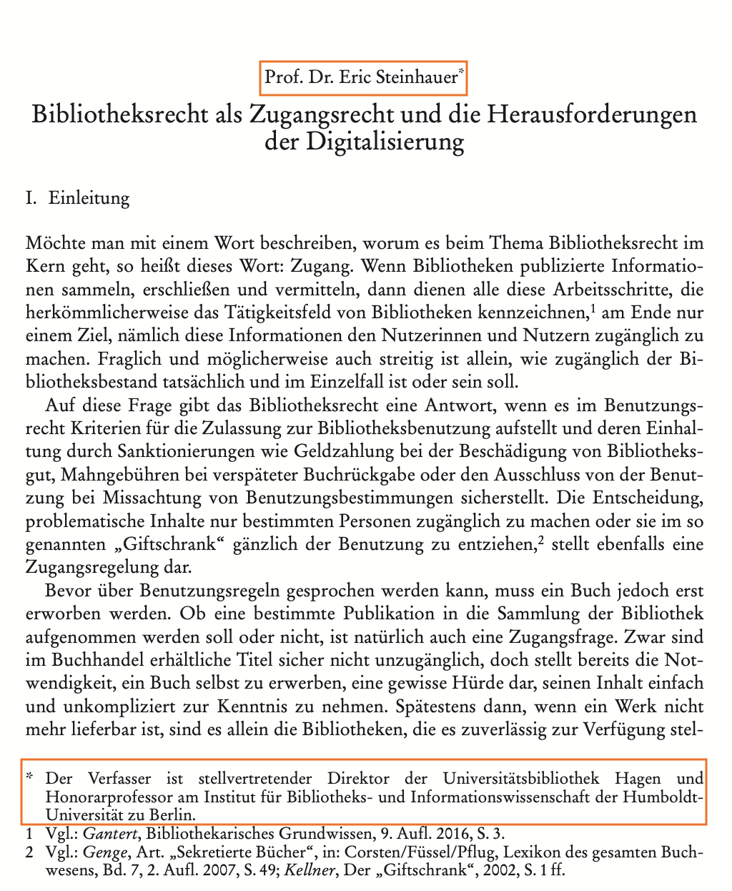

   The `*` note should be annotated as `<front>...</front>` because it is part of the
   bibliographic information header.

   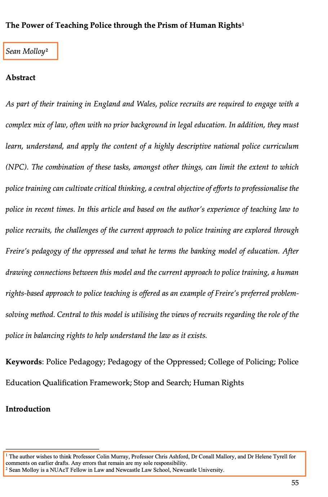

   Both references 1 and 2 are affiliation and acknowledgment, and should be annotated
   as `<front>...</front>`.

2. A pure footnote with a comment related to content in the text, annotated as
   `<note place="footnote">.....</note>`.

   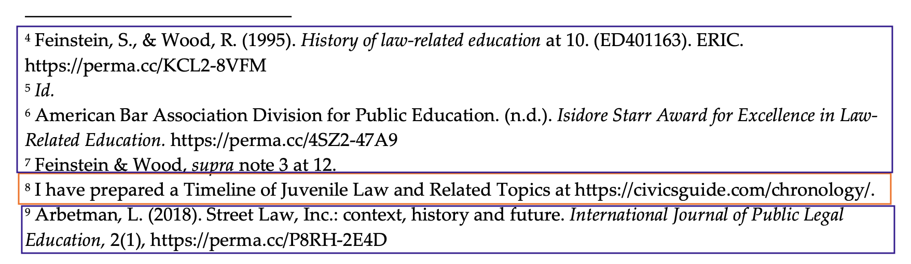

   "see reference 8" should be annotated as `<note place="footnote">`.

3. A pure reference, with the data of the referred article, annotated as
   `<listBibl>....</listBibl>`.

   Example: footnotes 4, 5, 6, 7 and 9 in the screenshot above should be annotated as
   `<listBibl>`.

4. Mixed content, with a comment related to the body and a reference annexed to it,
   annotated as `<listBibl>....</listBibl>` as well (see footnote 9 in the same
   screenshot). See [Reference segmentation model](#reference-segmentation-model) below
   for how the commentary and the citation(s) it introduces are annotated together.

> [!WARNING]
> - Due to the way text is extracted from the PDF, `<note place="headnote">`,
>   `<note place="footnote">`, and `<page>` elements are not necessarily where you
>   expect them — sometimes they are all placed at the bottom of the page. Just
>   annotate, do not move the elements around.
> - The page text extraction algorithm also sometimes strips the numbering of the
>   headers and places it elsewhere. Do not correct this either.

#### Tables and figures

Figures and tables belong to the main body structure: they are not specifically encoded
at the segmentation level.

Figures and tables, including captions, appearing after the references but related to
the body (e.g. a list of figures in preprints), should be under `<body>`. If a figure
or table appears inside an annex of an article, it should remain inside the
`<div type="annex">` element. If a figure or table appears in an abstract (which is
rare but might happen), it should remain within the `<front>` element.

#### Hidden characters

It happens that Grobid picks up hidden text that is present but not visible on the
PDF's page for the reader. Such content should not be surrounded by any element, to
indicate to Grobid that it should be ignored.

```xml
visible in lane 10 (longer exposure), where anti-rabbit secondary antibodies<lb/> were used. <lb/></body>

print ncb1110 17/3/04 2:58 PM Page 309 <lb/>

<note place="footnote">© 2004 Nature Publishing Group <lb/></note>
```

## Reference segmentation model

> [!NOTE]
> Model name in the PDF-TEI-Editor: `grobid.training.references.referenceSegmenter`,
> training files end in `.training.references.referenceSegmenter.tei.xml`

The reference segmenter is a model that takes the content of the `<listBibl>` label
produced by the segmentation model and does a more fine-grained segmentation, which can
then be parsed by the final citation (`references`) model.

The reference segmenter model is trained with two labels only:

- `<label>` — the reference number, e.g. "[1]" in a numbered bibliography, or the
  footnote number (as in "^1^ This is the first footnote.")
- `<bibl>` — encloses one individual reference
- `<bibl type="footnote">` — encloses one individual comment or note that does not
  refer to any reference (discussion:
  [#20](https://github.com/mpilhlt/fossil/issues/20)). This is to catch incorrect
  classification in the upstream "segmentation" annotation.

For footnote references, we use one `<bibl>` element per reference. The `references`
model (see [Citation model](#citation-model) below) then parses the content of each
`<bibl>` and extracts the reference metadata.

If there is commentary (i.e. content that is not bibliographic metadata), including
introductory signal words ("See also", "Vgl. z.B.", "Anderer Meinung:", etc.), include
it with the `<bibl>` it belongs to semantically. The comment will mostly precede but
sometimes also follow the reference (see below for examples). You need to look closely;
if in doubt, ask.

> [!NOTE]
> The `references` model has no notion of a labeled span sitting *between* two
> `<bibl>`s. When one comment or signal phrase introduces several references, it is
> annotated only once, inside the `<bibl>` it is closest to (see
> [Citation model](#citation-model) for how that same convention carries through into
> `<seg type="citationContext">` at the next stage).

### Examples

Here are some examples that we will expand with more cases as needed.

**Several references in one footnote**

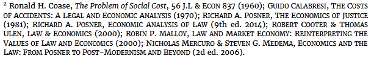

```xml
<bibl><label>2</label> Ronald H. Coase, The Problem of Social Cost, 56 J.L &amp; ECON 837 (1960); </bibl>
<bibl>GUIDO CALABRESI, THE COSTS<lb/> OF ACCIDENTS: A LEGAL AND ECONOMIC ANALYSIS (1970); </bibl>
<bibl>RICHARD A. POSNER, THE ECONOMICS OF JUSTICE<lb/> (1981); </bibl>
<bibl>RICHARD A. POSNER, ECONOMIC ANALYSIS OF LAW (9th ed. 2014); </bibl>
<bibl>ROBERT COOTER &amp; THOMAS<lb/> ULEN, LAW &amp; ECONOMICS (2000); </bibl>
<bibl>ROBIN P. MALLOY, LAW AND MARKET ECONOMY: REINTERPRETING THE<lb/> VALUES OF LAW AND ECONOMICS (2000); </bibl>
<bibl>NICHOLAS MERCURO &amp; STEVEN G. MEDEMA, ECONOMICS AND THE<lb/> LAW: FROM POSNER TO POST-MODERNISM AND BEYOND (2d ed. 2006).<lb/> </bibl>
```

**German legal citation**

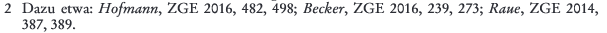

```xml
<bibl><label>2</label> Dazu etwa: Hofmann, ZGE 2016, 482, 498; </bibl>
<bibl>Becker, ZGE 2016, 239, 273; </bibl>
<bibl>Raue, ZGE 2014,<lb/> 387, 389.<lb/> </bibl>
```

**Introductory comment**

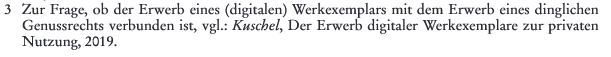

```xml
<bibl><label>3</label> Zur Frage, ob der Erwerb eines (digitalen) Werkexemplars mit dem Erwerb eines dinglichen<lb/> Genussrechts verbunden ist, vgl.: Kuschel, Der Erwerb digitaler Werkexemplare zur privaten<lb/> Nutzung, 2019.<lb/> </bibl>
```

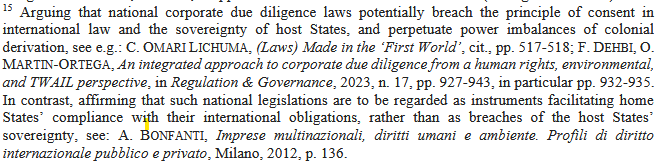

```xml
<bibl><label>15</label> Arguing that national corporate due diligence laws potentially breach the principle of consent in<lb/> international law and the sovereignty of host States, and perpetuate power imbalances of colonial<lb/> derivation, see e.g.: C. OMARI LICHUMA, (Laws) Made in the 'First World', cit., pp. 517-518; </bibl>
<bibl>F. DEHBI, O.<lb/> MARTIN-ORTEGA, An integrated approach to corporate due diligence from a human rights, environmental,<lb/> and TWAIL perspective, in Regulation &amp; Governance, 2023, n. 17, pp. 927-943, in particular pp. 932-935.<lb/> </bibl>
<bibl>In contrast, affirming that such national legislations are to be regarded as instruments facilitating home<lb/> States' compliance with their international obligations, rather than as breaches of the host States'<lb/> sovereignty, see: A. BONFANTI, Imprese multinazionali, diritti umani e ambiente. Profili di diritto<lb/> internazionale pubblico e privato, Milano, 2012, p. 136.<lb/> </bibl>
```

Here, the signal phrase ("Arguing that..., see e.g.:") semantically belongs to the
first and second references, but this cannot be expressed at the referenceSegmenter
stage, so it is put into the first `<bibl>` only. (At the `references` stage, this same
phrase is what becomes `<seg type="citationContext">` — see
[Citation-signal phrases](#citation-signal-phrases) below.)

**Trailing comment**

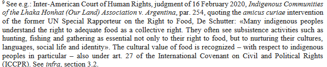

```xml
<bibl><label>9 </label>See e.g.: Inter-American Court of Human Rights, judgment of 16 February 2020, Indigenous Communities<lb/> of the Lhaka Honhat (Our Land) Association v. Argentina, par. 254, quoting the amicus curiae intervention<lb/> of the former UN Special Rapporteur on the Right to Food, De Schutter: «Many indigenous peoples<lb/> understand the right to adequate food as a collective right. They often see subsistence activities such as<lb/> hunting, fishing and gathering as essential not only to their right to food, but to nurturing their cultures,<lb/> languages, social life and identity». The cultural value of food is recognized -with respect to indigenous<lb/> peoples in particular -also under art. 27 of the International Covenant on Civil and Political Rights<lb/> (ICCPR). See infra, section 3.2.<lb/> </bibl>
```

**Court decisions**

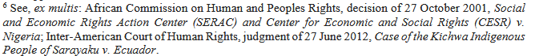

```xml
<bibl><label>6</label> See, ex multis: African Commission on Human and Peoples Rights, decision of 27 October 2001, Social<lb/> and Economic Rights Action Center (SERAC) and Center for Economic and Social Rights (CESR) v.<lb/> Nigeria; </bibl>
<bibl>Inter-American Court of Human Rights, judgment of 27 June 2012, Case of the Kichwa Indigenous<lb/> People of Sarayaku v. Ecuador.<lb/> </bibl>
```

**Comments not related to any citation in the footnote**

See examples in [#20](https://github.com/mpilhlt/fossil/issues/20).

**References to other references** (`id.`, `op. cit.`, `a.a.O.`, `ders.`, *supra*,
*infra*, "N. 22", "above") are, at the referenceSegmenter stage, simply part of the
`<bibl>` they occur in — no separate label exists for them here. They are only broken
out into their own `<ref type="...">` elements at the `references` stage; see
[Intra-footnote anaphoric references](#intra-footnote-anaphoric-references) below.

### Example from the demo

Sometimes the references are in separate sentences rather than separated by semicolons:

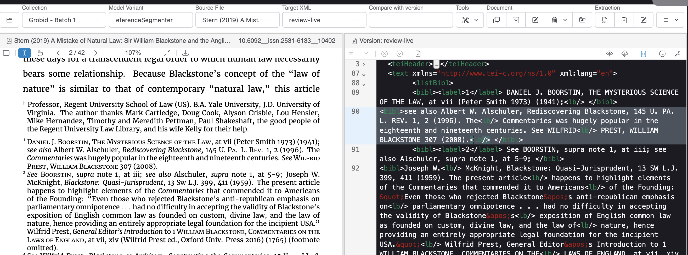

## Citation model

> [!NOTE]
> Model name in the PDF-TEI-Editor: `references`, training files end in
> `.training.references.tei.xml`

This section complements what's described in the
[related model in the Grobid documentation](https://grobid.readthedocs.io/en/latest/training/Bibliographical-references/).
It documents the legal/humanities-specific vocabulary added on top of Grobid's stock
`references` model to handle footnote citations — courts and legislatures as issuing
authorities, statute/marginal-number pinpoints, elliptical back-references, citation
signal phrases, and quotations. The full rationale for this vocabulary is written up in
[`tei-proposal-legal-footnote-citations.md`](tei-proposal-legal-footnote-citations.md)
(accepted by the TEI Technical Council as
[TEIC/TEI#2974](https://github.com/TEIC/TEI/issues/2974)) and in
[`spec-legal-references.md`](spec-legal-references.md) /
[`spec-legal-footnote-citations-schema-changes.md`](spec-legal-footnote-citations-schema-changes.md),
which describe how it was implemented in `schema/grobid.training.references.rng`.

The `references` model takes each `<bibl>` produced by the reference segmenter and
labels its internal structure. Every element below (except `<label>` and `<lb/>`) can
occur any number of times, in any order, inside a `<bibl>`.

### Genre of the cited work

```xml
<bibl type="legislation">...</bibl>
<bibl type="decision">...</bibl>
```

`legislation` marks a statute citation, `decision` a court ruling / judicial decision
citation. `<bibl type="footnote">` is reserved for a comment that is not a
bibliographic reference at all (see [Reference segmentation model](#reference-segmentation-model)
above); `type` is otherwise omitted for an ordinary (non-legal) reference.

### The issuing authority (`<authority>`)

```xml
<authority type="court">EuGH</authority>,
<date type="decision" when="2016-09-08">Urt. v. 8.9.2016</date> –
<idno type="docket">C-160/15</idno>, …
```

`<authority type="court"|"legislature">` names the institution responsible for the
cited work — a court, a legislature, or (outside the legal domain) a regulator or other
issuing body. Use it instead of `<author>` (an institution is not a person) and instead
of a bare `<orgName>` (which has no "responsible for this work" role).

`<orgName>` **may** still be nested inside `<authority>` to decompose a compound
institutional name, e.g. a court plus its deciding panel:

```xml
<authority type="court"><orgName>Oberlandesgericht Frankfurt am Main</orgName>, 5. Zivilsenat</authority>
```

`<orgName>` on its own (outside `<authority>`) remains available for institutional
authorship that is *not* an issuing authority — e.g. the institution behind a thesis or
technical report — with `@type` values `institution`, `collaboration`, `department`,
`laboratory`, or `jurisdiction`. `orgName@type="court"` is no longer used: use
`<authority type="court">` instead.

### Pinpoint vs. container extent

`<biblScope>` carries the cited work's *own* extent (volume, issue, page range).
`<citedRange>` carries the *pinpoint* into it — whatever level of granularity the
citing text actually names (a statute section, a marginal number, a recital). If a work
has no pagination at all (a decision cited only by marginal number, say), there is
simply no `<biblScope unit="page">` — only `<citedRange>`.

`<citedRange unit="...">` accepts:

| `@unit` | Matches |
| --- | --- |
| `section` | `§ 19a`, `Art. 5`, `Sec. 2` |
| `subSection` | `Abs. 2` |
| `sentence` | `S. 1`, `Satz 1` |
| `number` | `Nr. 3` |
| `letter` | `lit. b`, `Buchst. b` |
| `margin` | `Tz. 24`, `Rn. 20`, `Rdnr. 7` |
| `recital` | `ErwGr. 21` (EU recitals) |
| `page` | an in-text pinpoint page, e.g. the `(240)` in `233 (240)` |

```xml
<bibl type="legislation">
  <citedRange unit="section">§ 19a</citedRange>
  <citedRange unit="subSection">Abs. 2</citedRange>
  <title level="m" type="legislation" key="UrhG">UrhG</title>
</bibl>
```

### Docket and official identifiers

```xml
<idno type="docket">C-160/15</idno>
<idno type="ECLI">ECLI:EU:C:2016:644</idno>
<idno type="CELEX">…</idno>
```

`<idno type="...">` also covers the non-legal identifiers already in use: `DOI`,
`ISSN`, `arXiv`, `report`.

### Case short-name and statute short-title

```xml
<title level="a" type="caseName">GS Media/Sanoma</title>
<title level="m" type="legislation" key="UrhG">UrhG</title>
```

Tagging the case short-name explicitly, rather than leaving it as trailing free text,
is what stops the model from treating `– GS Media/Sanoma` as the start of a new
reference.

### Intra-footnote anaphoric references

Legal and humanities footnotes constantly avoid repeating a citation just given, using
devices such as *id.*, *op. cit.*, *ibid.*, *a.a.O.*, *ders.*, *supra*, *infra*,
"above," "N. 22." `<ref type="...">` labels these:

| `@type` | Meaning | Examples |
| --- | --- | --- |
| `precedingWork` | the work just cited | *supra*, *above*, `id.`, `op. cit.`, `a.a.O.` |
| `subsequentWork` | a work cited later | *infra*, *below* |
| `precedingAuthor` | the author just named, work unspecified | `ders.`, `idem` |
| `footnote` | an explicit cross-reference to another footnote, carrying `@n` | `n. 7`, `N. 22`, "oben N. 22" |

```xml
<bibl><author>Vogel</author>, <ref type="precedingWork">id.</ref>,
  <citedRange unit="page" from="79" to="79">p. 79</citedRange></bibl>

<bibl><author>Vogel</author>, <ref type="precedingWork">op. cit.</ref>,
  <ref type="footnote" n="7">n. 7</ref>,
  <citedRange unit="page" from="80" to="81">pp. 80–1.</citedRange></bibl>

<bibl><ref type="precedingAuthor">Ders.</ref>, <ref type="precedingWork">a.a.O.</ref>,
  <citedRange unit="page" from="123" to="123">S. 123</citedRange>.</bibl>
```

When two of these devices sit next to each other but are lexically distinct — e.g.
`Kaiser (oben N. 22) 89` — split them into two adjacent `<ref>`s rather than fusing
them into one:

```xml
<author>Kaiser</author>
(<ref type="precedingWork">oben</ref> <ref type="footnote" n="22">N. 22</ref>)
<biblScope unit="page" from="89" to="89">89</biblScope>
```

`@target` is available to hold a resolved pointer once the citation is resolved in
post-processing; it is not required for training annotation.

### Citation-signal phrases

Phrases that introduce a citation with an evaluative or directional stance — "See",
"See also", "Cf.", "But see", "Contra", "vgl.", "anderer Ansicht" — carry citation-
context information that is lost if the phrase is left as unlabeled prose. Mark the
whole introductory phrase (not just a single trigger word) with
`<seg type="citationContext">`:

```xml
<seg type="citationContext">For further analysis of the marriage contract, see</seg>
<author>K. O'Donovan</author>, <title level="m">Family Matters</title>
(<date type="publication" when="1993">1993</date>), especially
<citedRange unit="page" from="43" to="59">43–59</citedRange>.
```

`<seg type="citationContext">` marks only the signal phrase itself, not the citation
that follows it. Because the `references` model has no way to label a span *between*
two `<bibl>`s, when several citations share one signal phrase, keep the phrase only in
the first (or nearest) `<bibl>` it introduces — see
[A composite footnote](#a-composite-footnote) below and the referenceSegmenter's
["introductory comment" examples](#reference-segmentation-model) above.

### Quotations

`<quote>` pairs a direct quotation from the body text with the `<bibl>` that supports
it. No attributes: quotation marks and trailing punctuation stay in the source text.

```xml
<bibl><seg type="citationContext">…</seg><quote>„The U. S. law and development movement …"</quote>, <author>Merryman</author>, …</bibl>
```

### A real-world example: multiple references with multiple comments

Footnotes routinely mix several of the devices above in one paragraph — multiple
citations, each with its own signal phrase or `supra`-style back-reference:

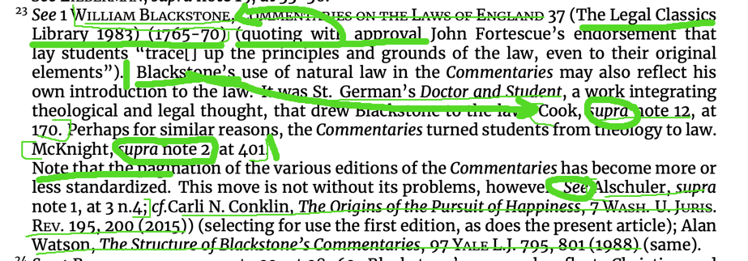

```xml
<bibl><label>23</label> <seg type="citationContext">See</seg> <author>1 William Blackstone</author>,
  <title level="m">Commentaries on the Laws of England</title>
  <citedRange unit="page">37</citedRange> (The Legal Classics Library 1983) (1765-70))
  (quoting with approval John Fortescue's endorsement that lay students "trace[] up the
  principles and grounds of the law, even to their original elements"). Blackstone's use
  of natural law in the <title level="m">Commentaries</title> may also reflect his own
  introduction to the law. It was St. German's <title level="m">Doctor and Student</title>,
  a work integrating theological and legal thought, that drew Blackstone to the law.
</bibl>
<bibl><author>Cook</author>, <ref type="precedingWork">supra</ref> <ref type="footnote" n="12">note 12</ref>,
  <citedRange unit="page">170</citedRange>. Perhaps for similar reasons, the
  <title level="m">Commentaries</title> turned students from theology to law.
</bibl>
<bibl><author>McKnight</author>, <ref type="precedingWork">supra</ref> <ref type="footnote" n="2">note 2</ref>,
  <citedRange unit="page">401</citedRange>. Note that the pagination of the various
  editions of the <title level="m">Commentaries</title> has become more or less
  standardized. This move is not without its problems, however.
</bibl>
<bibl><seg type="citationContext">See</seg> <author>Alschuler</author>,
  <ref type="precedingWork">supra</ref> <ref type="footnote" n="1">note 1</ref>,
  <citedRange unit="page">3</citedRange> n.4;
</bibl>
<bibl><seg type="citationContext">cf.</seg> <author>Carli N. Conklin</author>,
  <title level="a">The Origins of the Pursuit of Happiness</title>,
  <title level="j">7 Wash. U. Juris. Rev.</title>
  <biblScope unit="page" from="195" to="200">195, 200</biblScope> (2015))
  (selecting for use the first edition, as does the present article);
</bibl>
<bibl><author>Alan Watson</author>, <title level="a">The Structure of Blackstone's Commentaries</title>,
  <title level="j">97 Yale L.J.</title> <biblScope unit="page" from="795" to="801">795, 801</biblScope> (1988) (same).
</bibl>
```

The point is the pattern: one comment/signal phrase per `<bibl>` it introduces, `supra
note N` split into `<ref type="precedingWork">` + `<ref type="footnote" n="N">` exactly
as in [Intra-footnote anaphoric references](#intra-footnote-anaphoric-references), and
no special nesting for the multiple citations sharing one footnote. (This annotation
validates against `schema/grobid.training.references.rng`.)

### A composite footnote

The following footnote combines a footnote-number label, a short elliptical citation,
an explicit back-reference to another footnote, a multi-work citation joined by a
signal phrase, general prose, and a citation supporting a direct quotation — every
device introduced above, in one paragraph:

> 30 Dazu etwa Smelser 175 f. — Für die Kriminologie siehe Kaiser (oben N. 22) 89 sowie
> Blazicek/Janeksela, Some Comments on Comparative Methodologies in Criminal Justice,
> Int. J. Crim. Pen 6 (1978) 233 (240). Als besonders gefährlich hat sich die
> unkritische Übertragung solcher Konzepte auf Länder der Dritten Welt erwiesen. So kam
> man etwa zu dem Ergebnis: „The U. S. law and development movement was largely a
> parochial expression of the American legal style", Merryman, Comparative Law and
> Social Change - On the Origins, Style, Decline and Revival of the Law and Development
> Movement, Am. J. Comp. L. 25 (1977) 457 (479).

The citation context (`<seg type="citationContext">`) and the quotation (`<quote>`) are
annotated as *part of* the `<bibl>` they belong to (or are closest to, when several
citations follow one signal phrase, as in this example). This keeps it unambiguous
which citation a signal phrase or quotation is associated with, without needing a
separate mechanism to record that association. Which spans of running text join which
`<bibl>` is decided upstream, by the referenceSegmenter annotation task that first
splits a footnote into `<bibl>` spans (see [Reference segmentation model](#reference-segmentation-model)) —
not by the `references` model itself.

```xml
<listBibl>
  <bibl>
    <seg type="citationContext">Dazu etwa</seg>
    <author>Smelser</author>
      <biblScope unit="page" from="175" to="176">175 f.</biblScope> -
  </bibl>

  <bibl>
    <seg type="citationContext">Für die Kriminologie siehe</seg>
    <author>Kaiser</author>
    (<ref type="precedingWork">oben</ref> <ref type="footnote" n="22">N. 22</ref>)
    <biblScope unit="page" from="89" to="89">89</biblScope> sowie
  </bibl>

  <bibl>
    <author>Blazicek</author>/<author>Janeksela</author>,
    <title level="a">Some Comments on Comparative Methodologies in Criminal Justice</title>,
    <title level="j">Int. J. Crim. Pen</title>
    <biblScope unit="volume">6</biblScope>
    (<date type="publication" when="1978">1978</date>)
    <biblScope unit="page">233</biblScope>
    <citedRange unit="page">(240)</citedRange>.
  </bibl>

  <bibl>
    <seg type="citationContext">Als besonders gefährlich hat sich die unkritische Übertragung solcher Konzepte auf Länder der Dritten Welt erwiesen. So kam man etwa zu dem Ergebnis:</seg>
    <quote>„The U. S. law and development movement was largely a parochial expression of the American legal style"</quote>,
    <author>Merryman</author>,
    <title level="a">Comparative Law and Social Change - On the Origins, Style, Decline and Revival of the Law and Development Movement</title>,
    <title level="j">Am. J. Comp. L.</title> <biblScope unit="volume">25</biblScope>
    (<date type="publication" when="1977">1977</date>)
    <biblScope unit="page">457</biblScope>
    <citedRange unit="page">(479)</citedRange>.
  </bibl>

</listBibl>
```

A composite, multi-citation footnote like this one is just several ordinary sibling
`<bibl>` elements inside `<listBibl>` — no special nesting or nesting of `<bibl>`
inside `<bibl>` is used or needed.
